# Donimoes: New Games and Puzzles
When I tell people that I like domino games, they are often surprised to hear
that you can do more than just match the numbers. If you look in a book of
games, often with Mr. Hoyle's name on the cover, you might find the basic game
and maybe All Fives. If you're lucky, you'll find Chickenfoot and Mexican Train.

This book is a collection of domino games and puzzles that will broaden your
horizons beyond a chain of dominoes with matching numbers. You'll find new games
and puzzles that I designed, as well as some of my favourite domino games and
puzzles by other designers:

* **Unmatched Donimoes** is a puzzle I designed where you have to slide all the
    dominoes into a rectangular shape, without sliding any matching numbers next
    to each other. (1 player, double-six dominoes)
* **Capturing Donimoes** is a puzzle I designed where you have to collect all the
    dominoes by sliding matching numbers next to each other.  (1 player,
    double-six dominoes)
* **Mirror Donimoes** is a puzzle I designed where pawns walk around on top of
    the dominoes. (1 player, double-six dominoes, 4 pawns)
* **Tetradominoes** is a game I designed for one to four players where you play
    matching dominoes in a grid, then try to play the tetromino shapes on top.
    (1-4 players, double-six dominoes, 7 cardboard tetrominoes, and some beads,
    buttons, or coins)
* **Bee Donimoes** is a puzzle race game I designed where a swarm of dice bring
    nectar back to the hive. (1-6 players, double-six dominoes, 3-6 dice, and a
    timer)
* **Domino Finder** is a memory game I designed where you have to find the
    treasure domino without falling in a trap. (2-4 players,
    double-six dominoes, pawns, and two dice)
* **Mountains and Valleys** is a solitaire game by Sid Sackson where you have to
    lay out a map that you can hike on. I adapted it from paper, pencil, and
    dice to use dominoes.
* **Fujisan** is a solitaire game by James Droscha where you help four Shinto
    priests climb to the peak of Mount Fuji. I found 20 layouts that are much
    more challenging than usual. (1 player, double-six dominoes, and four pawns)
* **Cobra Paw** is a quick-reaction game by Derek Weston. (2-4 players,
    double-six dominoes, and two dice)
* **All Fives** is a traditional dominoes game, where you score points by making
    the ends add up to a multiple of five. (2-4 players, double-six dominoes)
* **Dominosa** is the classic domino puzzle by O.S. Adler where you have to fit
    the set of dominoes onto a grid of numbers.
* **Domino Runners** is based on board games by Roland Siegers, where your
  runners run across a grid of dominoes, dropping checkers and trying to capture
  your opponent's checkers. (2 players, double-six dominoes, 2 dice, and
  checkers)

## Unmatched Donimoes
A puzzle I designed that's the opposite of traditional dominoes: matches are
forbidden.

### Goal
The goal is to slide all the dominoes into a rectangle, without sliding any
matching numbers next to each other.

### Moves
Move a domino one space along its long axis so that none of its numbers match
an adjacent number on a neighbouring domino. In this example, the lower domino
can move to the right, because the three doesn't match the two, and the four
doesn't match the 3. You couldn't move it another space to the right, because
then the threes would be right next to each other.

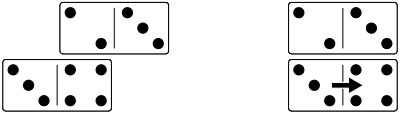

### Stay Connected
All the dominoes in the puzzle have to be connected in one solid group, diagonal
connections don't count. When you move a domino, it can be disconnected during
the move, as long as it is connected at the start and the end of the move.
Remember that it can only move one space at a time, though.

### Problems
Here are the starting positions for several Unmatched Donimoes problems. The
solutions are listed at the end.

#### Problem 1
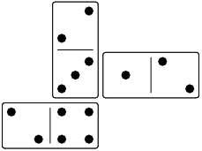

#### Problem 2
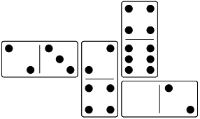

#### Problem 3

#### Problem 4
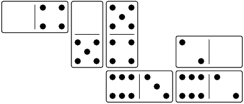

#### Problem 5
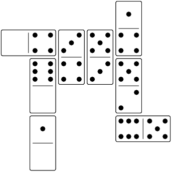

#### Problem 6
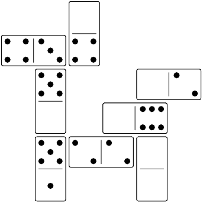

#### Problem 7
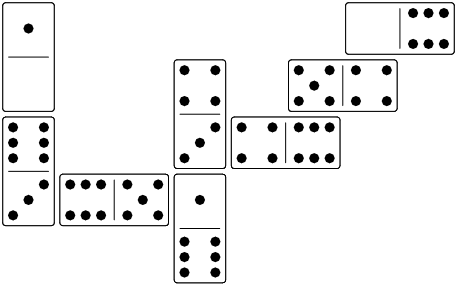

#### Problem 8
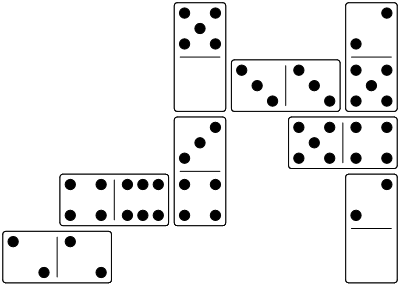

#### Problem 9
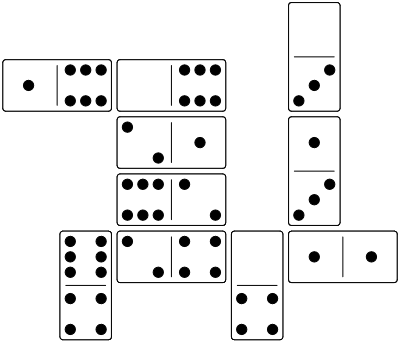

#### Problem 10
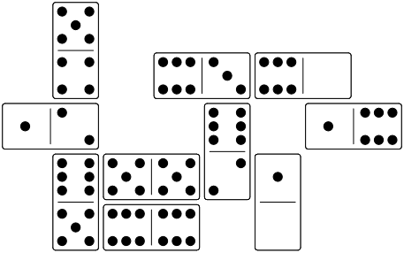

#### Problem 11

#### Problem 12
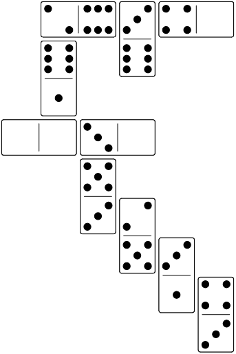

#### Problem 13
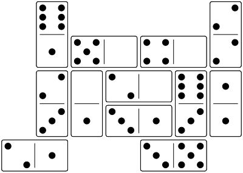

#### Problem 14
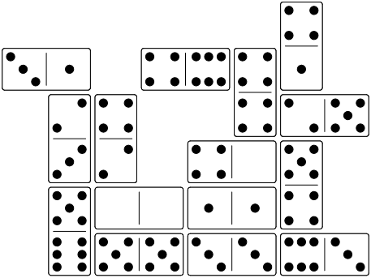

#### Problem 15
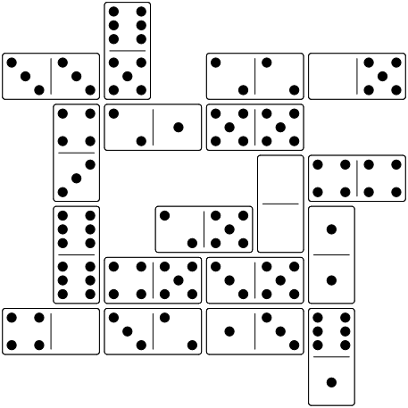

#### Problem 16
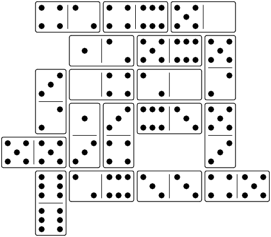

#### Problem 17
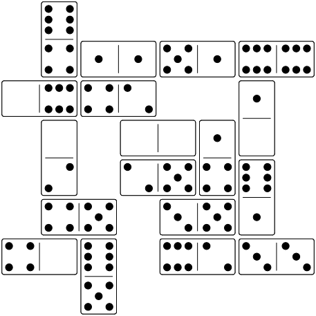

#### Problem 18
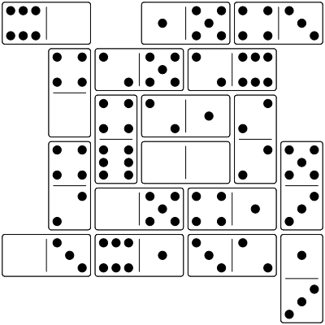

#### Problem 19
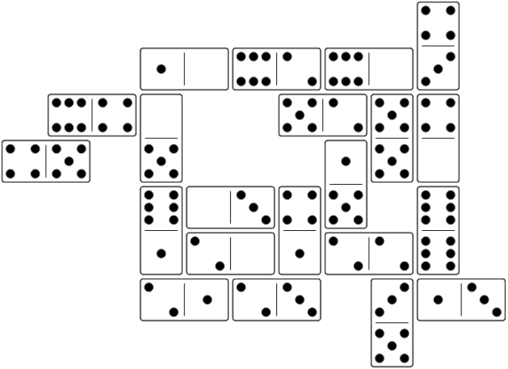

#### Problem 20
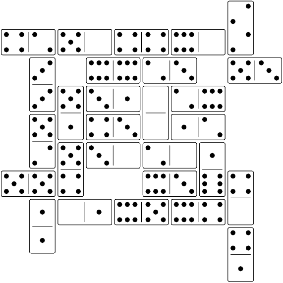

## Capturing Donimoes
A puzzle I designed to feel like a safari in heavy traffic.

### Goal
The goal is to collect all the dominoes by sliding matching numbers next to
each other.

### Moves
There are only two ways a domino can move: matching and adding.

#### Matching
Move a domino one space along its long axis so that it ends up with at least
one of its numbers matching an adjacent number on a neighbouring domino. Then
collect the domino you moved and any dominoes that match it, by removing them
from the pattern. In this example, the threes match, so you collect both
dominoes: solution found!

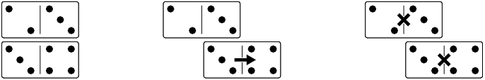

#### Adding
Move a domino one space along its long axis so that it ends up with at least
one of its numbers next to an adjacent number that adds up to six. With an
adding move, no dominoes are removed. In this example, the two adds up with the
four above it to make six.

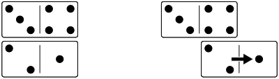

Sometimes, you can collect more than two dominoes at once. In the first
example, the two matches twos on both of the other dominoes, and you collect
all three dominoes. In the second example, the two matches the two to the left,
and the four matches the four above it. You collect all three dominoes.

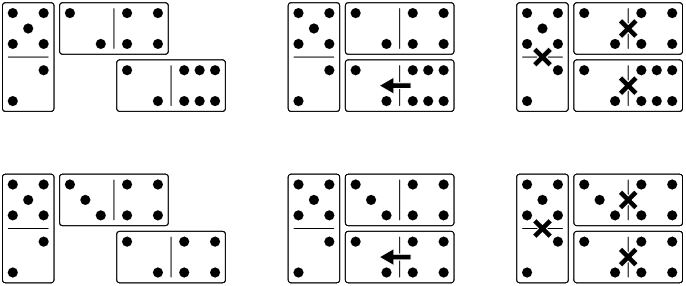

#### Stay Connected
All the dominoes must stay in one connected group, you can't split the group
after moving or after removing the matching dominoes.

### Problems
Here are the starting positions for several Capturing Donimoes problems. The
solutions are listed at the end.

#### Problem 1
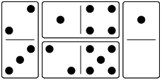

#### Problem 2
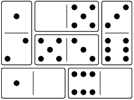

#### Problem 3
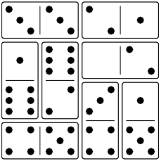

#### Problem 4
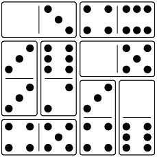

#### Problem 5
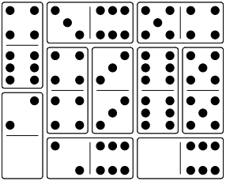

#### Problem 6
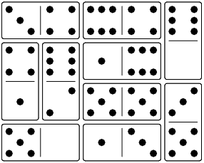

#### Problem 7
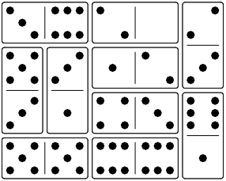

#### Problem 8
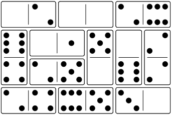

#### Problem 9
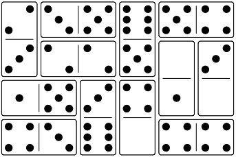

#### Problem 10
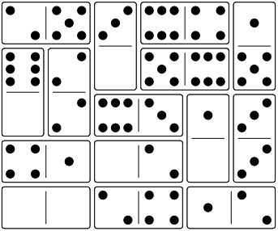

#### Problem 11
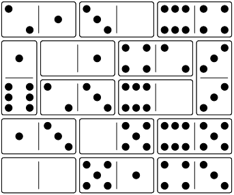

#### Problem 12

#### Problem 13
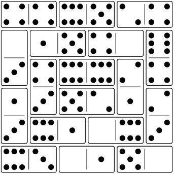

#### Problem 14
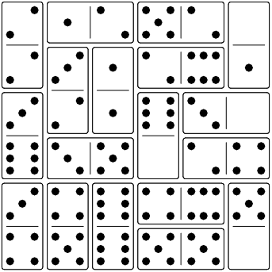

#### Problem 15
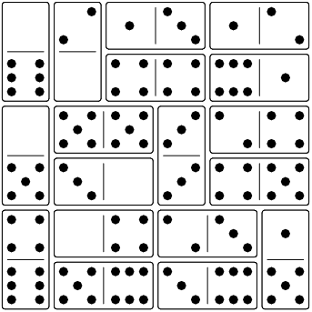

#### Problem 16
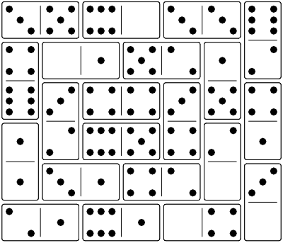

#### Problem 17
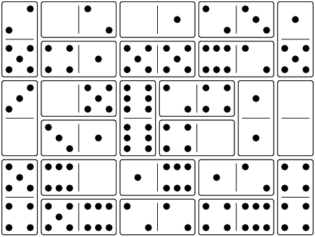

#### Problem 18
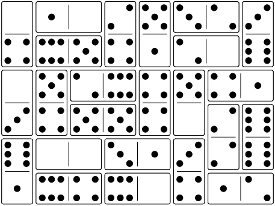

#### Problem 19
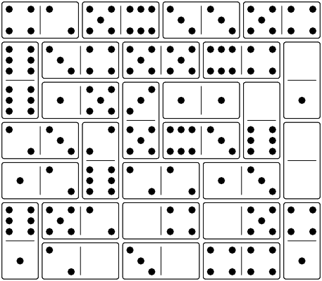

#### Problem 20
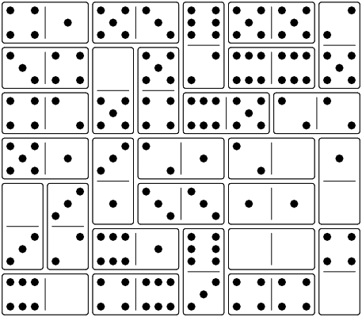

## Mirror Donimoes
Help four ghosts find each other in a haunted house. Each domino is a room in
the house, and the ghosts can't go through the closed doors. They can go through
the mirrors, though. Spooky!

### Goal
Move all the pawns into one connected group. Diagonal connections don't count.

### Start
Place the dominoes in the starting position shown in the problem, then put a
pawn on top of each corner space.

### Moves
Each turn, you can make a domino move or a pawn move.

#### Domino Moves
The house is so spooky, the rooms can move. If a domino has one or two pawns on
it, you can slide the domino one space along its long axis. The pawns go
along for the ride. You can only move one domino at a time, and all the dominoes
must stay connected in one group before and after the move. Diagonal connections
don't count.

Remember, a domino with no pawns on it cannot move.

#### Pawn Moves
The ghosts can always move around the room, and they can move through mirrors to
the room next door. You can move a pawn one space up, down, or sideways, with a
few restrictions.

* Two pawns can't be on the same space, but you can have a pawn at each end
    of a domino.
* Moving to a neighbouring domino is only allowed if the number you move to
    matches the number you were on. (There's a mirror for the ghost to go
    through.)
* Pawns have to stay on top of the dominoes - no leaving the house.
* Diagonal moves are not allowed.

### Example
Here's a small problem to start with. First, set up the dominoes as shown in the
starting position.

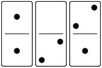

Then put a pawn on each corner. You can use four identical pawns, but for this
example and the solutions at the end, we use a regular (P)awn, a (B)ishop, a
k(N)ight, and a (R)ook as four different types of pawn, so you can keep track of
which is which. The small white dots show you the number under each pawn.

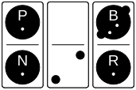

In this position, none of the numbers match their neighbours, so there are no
mirrors for the pawns to move between dominoes. However, the 2 under the
bishop could match the 2 in the middle, so the first move is to slide the
bishop's domino down.

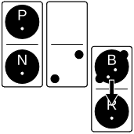

Now that there's a mirror to move through, the bishop can move to the left.

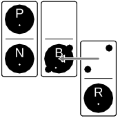

The last move is to join the ghosts into a single, connected group, and there
are two choices. We can just move the rook to the other end of its domino, or
we can slide the rook's domino back up, and the rook comes along for the ride.

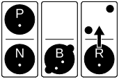

### Problems
Here are the starting positions for several Mirror Donimoes problems. The
solutions are listed at the end.

#### Problem 1
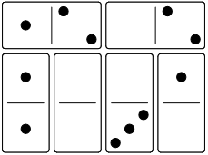

#### Problem 2
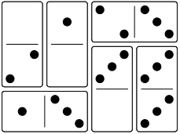

#### Problem 3
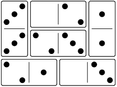

#### Problem 4
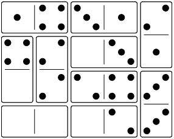

#### Problem 5

#### Problem 6

#### Problem 7

#### Problem 8

#### Problem 9

#### Problem 10

#### Problem 11

#### Problem 12

#### Problem 13

#### Problem 14

#### Problem 15

#### Problem 16

#### Problem 17

#### Problem 18

#### Problem 19

#### Problem 20

You'll need patience for this one. Did I go too far?

# Domino Games
I really enjoy classic domino games like All Fives, and I've played recent
inventions like Chickenfoot and Mexican Train. However, I thought I might be
able to design a domino game that felt more like a grid than a chain.
Tetradominoes is my attempt to do that.

## Tetradominoes
Play matching dominoes in a grid, then try to play the tetromino shapes on top.

### Players
1 to 4 (See the solitaire rules at the end.)

### Equipment
* a set of dominoes from double blank to double six
* a set of tokens (small chips or cubes that are small enough to fit on top of a
    domino) - 2 players need 1 light token and 1 dark token, 3 players need 3
    tokens in each of 3 colours (9 in total), and 4 players need 2 light tokens
    and 2 dark tokens
* seven cardboard tetrominoes (white on one side, black on the other)

To make your own set of tetrominoes, draw these seven shapes on a piece of
plain cardboard, and cut them out. Use a marker to colour one side of each
shape. Each shape should be big enough fit on top of four domino numbers, with a
small gap around the outside.

### Object
Play the most tetrominoes.

### Setup
Choose a player to go first through any convenient method. In a 2-player game,
the first player takes the light token. The other player takes the dark token.
In a 3-player game, each player takes all the tokens of one colour. In a
4-player game, the first player and the player opposite each take a light token
and the other players take a dark token. Players with the same colour tokens
will play as partners.
 
Shuffle the dominoes face down, and draw four for each player, keeping them
hidden from the other players. Put the remaining dominoes and the tetrominoes
within reach.

### Playing Dominoes
On the first turn, play any domino you like. On each turn after that, you must
play a domino so that at least one of its numbers is adjacent to a matching
number on a domino that was already played, and isn't covered. For example,
the 36 domino can be added as shown, because the 3 matches its neighbour.

In this example, the 46 cannot be added in this position, but it could be
flipped to make the 4 match its neighbour.

You don't have to match along the long side, you could also play it like this.

If there are no numbers uncovered at the start of your turn, play a domino so
that at least one of its numbers is adjacent to a covered number (they don't
have to match). If none of your dominoes match the available numbers, reveal two
of your hidden dominoes, and draw one more, keeping it hidden from the other
players. If you still can't play, repeat until you can. If you still can't play
when there are no more dominoes to draw or when you don't have two hidden
dominoes, reveal all of your hidden dominoes, and pass your turn. Leave any
revealed dominoes face up until you play them.

If you have fewer than four dominoes, draw a domino and keep it hidden from the
other players.

### Playing Tetrominoes
After playing a domino, see if you can play a tetromino. It must cover one or
both numbers on the domino you just played, it can't hang off the edge of the
dominoes, and it can't cover any numbers different from the ones on the domino
you just played. Also, two tetrominoes of the same colour can't be right next to
each other. (Diagonal is allowed.)

For example, if you just played the 46 domino, you could play an L-shaped
tetromino on the 4, 4, 4, and 6 numbers.

With 2 or 4 players, if you have a light token, you must play tetrominoes with
the light side up. If you have a dark token, you must play with the dark side
up. With three players, all players play tetrominoes with the light side up, and
then place one of their tokens on the tetromino.

With 4 players, after a tetromino is played, the two opposing players may each
take a domino from their hand, and trade with their partner. This is useful if
your partner is about to play and you have a domino that matches something on
the board. It can also be useful when you have two dominoes that will work well
together. However, you can't tell your partner how to play what you give them. 

### Game End
With 2 or 4 players, the game ends when one player or team plays four
tetrominoes and wins. With 3 players, the game ends when one player plays three
tetrominoes and wins.

### Solitaire
All the rules about playing dominoes and tetrominoes stay the same, but you're
trying to fit all of the tetrominoes into a small space. You can play the
tetrominoes either side up, but you get more points if they are mostly the same
colour. If you play a domino that can have a tetromino played on it, you must
play that tetromino. If you can't play any dominoes, discard one tetromino to
count as unplayed, and draw up to four dominoes. Then put the same number of
dominoes back in the pile, and shuffle the pile face down.

**Level 1** - At the end of the game, count the number of black tetrominoes B,
the number of white tetrominoes W, and the number of unplayed tetrominoes X.
Calculate your score as BxW + 7xX. You win if your score is less than 10.

**Level 2** - At the end of the game, imagine a rectangle surrounding the
dominoes you played. Count the numbers along the longest side, and add that to
the level 1 score. You win if your total score is less than 15. Good luck!

### Tournament
Tournament play is a series of games until one player wins seven points. One
point for each tetromino.

## Bee Donimoes
A puzzle race game where a swarm of dice bring nectar back to the hive.

### Players
1-6

### Equipment
* a set of dominoes from double blank to double six
* 3 to 6 six-sided dice
* a one-minute timer

### Object
Bring the nectar back to the hive in as few moves as possible, faster than the
other players. The biggest die is the queen bee and doesn't move, the others
have to form a connected group around her.

### Setup
Decide how many dice you want to use: 3 or 4 are good for learning the game, and
5 or 6 make more challenging puzzles. Put aside all the dominoes with numbers
higher than the number of dice, and shuffle the rest. Then place the shuffled
dominoes face up to form a rectangle of numbers.

Look for the dominoes with a number at one end and a blank at the other. The
number on each of those dominoes is the starting space for the die with the
matching number. Take 3 dice, turn them so the numbers 1, 2, and 3 are on top,
then place them on their starting spaces.

For example, here's one possible setup for four dice:

### Play
The die with the largest number is the queen bee, which never moves during the
round. All the smaller bees have to bring their nectar back to her in one
connected group. (Diagonal connections don't count.)

The dice can only land on their own numbers or on unoccupied blanks. They can
move in two ways:
1. In a straight line along a row or a column. They can pass over other numbers,
   squares with their own number, or other dice. This counts as one move.
2. Changing direction over other dice. In the middle of a regular move, a die
   may make a 90° turn directly above another die. Later in the same move, it
   may make more turns directly above other dice. No matter how many turns it
   makes, this still counts as one move.

See the example solution after the rules.

### Solve
As soon as the queen bee is placed, all players try to solve the puzzle at the
same time. Do not touch the dominoes or dice while you are trying to solve the
puzzle! Once a player has found a solution, they say the number of moves they
need, and start the timer. The other players have until the timer ends to find
a better solution.

A solution with fewer moves is always better. If two players find solutions with
the same number of moves, then the player with fewer points wins the tie. If
they have the same points, then the player who said it first wins the tie.

If there is no solution, then the first player to say it's impossible starts the
timer. They win the round if no other player can find a solution before the
timer ends.

### Demonstrate
Whichever player has claimed the best solution when the timer ends has to
demonstrate that solution, counting the moves out loud. Players should
demonstrate with no more than a few seconds of hesitation. If they made a
mistake or can't remember the solution, let the player who claimed the next best
solution demonstrate it.

The player who successfully demonstrates a solution scores one point.

### Next Round
Put the dice back on their starting spaces. If there are any empty starting
spaces, start the next round by adding the next bigger die on its starting
space. Otherwise, shuffle all the dominoes and set up again.

### Example Solution
Let's solve the set up above, where the 3 die is the queen bee. The first thing to
do is check whether there are enough places for the bees to land around the
queen bee. The queen is surrounded on three sides by 3s and 4s, so something has
to land on the wild space. Next to that is a 4 and a 2, so you know that the
1 has to end up on the wild space with the 2 next to it.

Now that we know where we're going, it seems best to start by moving the 2 where
it can guide the 1 onto the wild spot:

With the 2 in place, the 1 can get to its target.

Finally, the 2 can get to its target with the help of the 1, in a nice leapfrog
pattern.

### End Game
Play for an agreed number of rounds, the player with the most points wins. In
case of a tie, play an extra round.

To play a series of games, start with 3 dice and play 1 round. Add in another
die and all the dominoes with numbers up to 4, then play 2 rounds. Continue with
5 and 6 dice for a total of 10 rounds.

For experienced players, play 3 cycles with 6 dice for a total of 12 rounds.

### Advanced Version
Letting the dice land on the blanks makes the game easier to solve. For more
challenging puzzles, only let the dice land on one blank: the blank on the
queen bee's domino.

If you find the race too stressful, play cooperatively or as a solitaire.

### Problems
When you randomly lay out the dominoes, most solutions will take between 3 and
6 moves. Here are some carefully chosen layouts that range from easy to very
challenging. Record how many moves you used for each queen bee, and then compare
to the solutions at the end. These problems all use the advanced version of the
rules, so the only blank you can land on is the one on the queen bee's domino.

#### Problem 1

#### Problem 2

#### Problem 3

#### Problem 4

#### Problem 5

#### Problem 6

#### Problem 7

#### Problem 8

#### Problem 9

#### Problem 10

#### Problem 11

#### Problem 12

#### Problem 13

#### Problem 14

#### Problem 15

#### Problem 16

#### Problem 17

#### Problem 18

#### Problem 19

#### Problem 20

## Domino Finder
A memory game with hidden traps.

### Players
2-4

### Equipment
* a set of dominoes from double blank to double six
* one pawn for each player, in different colours
* two six-sided dice

### Object
For 2 players, find 5 treasure dominoes. 3 players find 4, or 4 players find 3.

### Setup
Find the 7 dominoes that have blanks, gather them into a pile, and shuffle them
face down. Shuffle the other 21 dominoes face down in a separate pile. Then,
take 1 domino from the blanks pile and 3 from the other pile. Shuffle them
together so you don't know what numbers they have and you don't know which has
a blank. Lay them out face down in a long thin row. Repeat the process until you
have 7 rows side by side, but leave gaps between the rows so you can turn them
over as you play. You should end up with a rectangle of 7x8 secret numbers.

Each player rolls the two dice, and the highest number plays first. Reroll to
break ties. The starting player rolls the two dice to choose the treasure
domino.

### Play
On your first turn, place your pawn next to one of the face-down dominoes along
the edge of the board. Every turn, you flip up one face-down domino, and move
your pawn onto it. Your pawn must be next to the domino you want to flip up,
but you may move it over dominoes that are already face up, before you get to
the domino you want to flip up. You may also move it over empty spaces where
dominoes have been removed. You may not move it over blanks or face-down
dominoes. Once your pawn is next to the face-down domino you want to flip,
place your pawn next to one end, and then flip the domino around the long axis,
so the numbers stay in the same position. If you flip over a blank square next
to your pawn, then you stepped in a trap! Place your pawn on the blank square,
and skip your next turn.

If you flip over a domino that matches the two dice, you found the treasure!
Place the treasure domino face up in front of you, move your pawn into the
empty space, and prepare for the next treasure:
 
* Flip every revealed trap so that it is face down, unless there's a pawn on it.
* Roll the dice to see what the next treasure is.
* If you roll numbers that match a previous treasure domino that's now in front
    of a player or if they match a domino that a player's pawn is on, just roll
    again.
* If you roll numbers that match a face-up domino, flip it face down. Roll
    again.

Whether you found the treasure or not, your turn ends after flipping one domino.
The turn passes to the player on your right.

### Winning
As soon as you collect enough treasures, you win the game.

# Domino Puzzles By Other Designers
## Mountains and Valleys
Sid Sackson is one of my favourite game designers. He designed Acquire, Can't
Stop, and I'm the Boss, among many, many others. He included Mountains and
Valleys in his [Beyond Solitaire][solitaire] book, and I adapted it from paper,
pencil, and dice to use dominoes.

To start, shuffle a set of double-six dominoes face down, then turn 18 of them
face up. The remaining 10 aren't used. Then arrange the dominoes into a 6x6
square of numbers that represents a map of mountains and valleys, where blanks
are at sea level, and sixes are the highest peaks. The goal is to make a map
where you can walk to every square. You can walk from one square to its
neighbour if the two heights are the same or differ by one. (You can't climb
cliffs.)

For example, this set of 18 dominoes:

can be arranged into this solution, where the grey lines show the paths you can
walk along:

I like this solitaire, because it can almost always be solved, though finding a
solution can be very difficult. There's usually more than one solution. For
example, you can flip the 56 domino, above. There is a trivially unsolvable
situation whenever one of the numbers from 1 to 5 is completely missing, but
that can be quickly checked, and I haven't found any other unsolvable
combinations.

### Cooperative Version
You can play Mountains and Valleys cooperatively with other players. Shuffle the
dominoes face down, then draw 9, 6, or 5 dominoes each when there are 2, 3, or 4
players, respectively. Keep your dominoes hidden from the other players.

Randomly choose a player to go first. That player chooses one of their dominoes
and passes it to the player on their left. The player receiving the domino plays
it on the table, then chooses one of their dominoes and passes it to the player
on their left. Play continues in the same pattern until a 6x6 square is
complete. After the first domino, all dominoes must be played so they have at
least one neighbour, and they can't be moved after they are added.

When the 6x6 square is complete, see if the whole map is connected as described
in the solitaire game. If you need a step of more than one level to get from one
section of the map to another, you get a penalty of the number of levels. For
example, if a map is completely connected except that you need to go from a 3
to a 5, then you would have a 2 point penalty. A perfect game is zero, and
anything under 5 is a good game.

With four players, the last two players will each have an extra domino left at
the end of the game.

For a harder solitaire version, draw 18 dominoes, but only turn five of them
face up. Each time you play a domino, turn another one face up, until you've
turned up all 18. Then play the last five. Use the same placement and scoring
rules as the cooperative version.

[solitaire]: https://boardgamegeek.com/game/3940

## Fujisan
James Droscha is best known as the designer of the piecepack game system, and
he designed Fujisan for the piecepack, then adapted it for dominoes and pawns in
a paper on [using entangled components in solitaire games][droscha].

Four Shinto Priests have traveled from their various prefectures in pilgrimage
to the top of Mount Fuji. You must find pathways for them to move up and down
the mountain until they can all achieve the peak. Often, this will require you
to guide them into positions from which they can assist each other.

### Setup
Remove all dominoes with the number six and all doubles from a standard set of
double-six dominoes. Shuffle the remaining 15 dominoes face down, then place
twelve face-up dominoes side by side. Leave the three remaining dominoes face
down, and use them to lift up the two middle dominoes as the peak of Mount Fuji.
Here's an example layout:

Place a Priest (pawn) beside each number at both ends of the mountain.

### Moving a Priest
1. A Priest may move onto a space if the number matches the number of unoccupied
  spaces the Priest must move in a straight line to get there (including the
  destination space itself, but not including the space the Priest's starting
  space). For example, a Priest may move onto a space containing a value 4 coin
  if there are 3 unoccupied spaces between it and the Priest.
2. Occupied spaces (containing intervening Priests) are not counted when
  determining if a Priest may move onto a particular space. For example, a
  Priest may move onto a space containing a value 2 coin if there are 3 occupied
  spaces and one unoccupied space between it and the Priest.
3. A Priest may move freely between the two spaces on a domino. This is the only
  manner in which a Priest may move onto a blank space.
4. Once a Priest lands on the peak of the mountain, he will refuse to leave it,
  but he can move back and forth (in the same domino) or to and fro (between the
  two dominoes). Clarification: A Priest may pass over the peak dominoes as part
  of a move.
5. A Priest must enter the mountain from his own starting row; that is, he
  cannot move back or forth while he remains on the ground.

### Goal
The Priests will be content when they all reach the top of the mountain.

### Variant
Country Road: Once all four Priests have reached the peak, move the dominoes
at the peak to the Priests' original setup positions at the two ends of the
mountain and continue until all four Priests have left the mountain.

Treat the spaces at the peak as blanks. Once a Priest leaves the mountain, he
will not step back on.

[droscha]: https://arxiv.org/abs/1810.01926

### Problems
Shuffling the dominoes generates a nice set of Fujisan problems. In 1000
randomly generated problems, 92% were solvable. Of those, the median solution
length was 14, with half of them between 12 and 16. Here are some more
challenging problems for you to try. The solutions are listed at the end.

#### Problem 1

#### Problem 2

#### Problem 3

#### Problem 4

#### Problem 5

#### Problem 6

#### Problem 7

#### Problem 8

#### Problem 9

#### Problem 10

#### Problem 11

#### Problem 12

#### Problem 13

#### Problem 14

#### Problem 15

#### Problem 16

#### Problem 17

#### Problem 18

#### Problem 19

#### Problem 20

## Cobra Paw
Derek Weston is a new game designer who designed this cute quick-reaction game
in 2017. I adapted it to use regular dice and dominoes, but the original game
has custom dice and dominoes with some nice design features, so check it out if
you like this basic version.

### Players
2 - 4

### Equipment
* a set of dominoes from double blank to double six
* two six-sided dice

### Object
Collect six dominoes

### Setup
Shuffle all the dominoes face up in the centre of the table.

Any player rolls the dice.

### Play
All players try to find the target domino - the one that matches the numbers on
the two dice. As soon as you find it, put one finger on the centre of the
domino. Whoever gets their finger on the target first, takes it and places it
face down in front of them. Then they roll the two dice to start the next
search. When you put your finger on the target, be sure not to cover the
numbers, so the other players can still see that you got the right one.

If you think the target is already face down, be the first to put your finger on
the double blank. If none of the other players can find the target, you can take
any remaining domino except the double blank and place it face down in front of
you. If you're wrong and another player finds the target, though, all the other
players get to take a domino! Plus, the player who found the target gets to take
it as well.

### Winning
The first player to take six dominoes wins the game. If two players take their
sixth domino at the same time, hunt for another domino.

## All Fives
Of the traditional domino games, this is my favourite. It has a lot of the same
appeal as cribbage: some basic arithmetic, and playing the odds. Just make sure
you understand how the sniff works.

### Players
2 - 4

### Equipment
* a set of dominoes from double blank to double six

### Object
Score points by making the ends add up to a multiple of five.

### Setup
Shuffle the dominoes face down, then draw 7 dominoes each, keeping them hidden
from your opponents. (Draw 5 when there are 3 or 4 players.)

### Play
On your turn, you must play a domino with a matching number. In this example,
the 24 domino has just been played. It's a valid move, because its 2 matches the
2 on the open end.

This example is not valid, because the 4 is played against a number that doesn't
match.

Dominoes must either be played against an end of the line, or against the sniff.
(The sniff is explained below in the rules for doubles.) This example is not
valid, because the 34 domino wasn't played against one of the ends.

### Draw
You may draw extra dominoes before you play one, to give you more options. If
you can't play any of your dominoes, then you must draw extra dominoes until you
get one that you can play. If there are no dominoes left to draw and you can't
play any, then pass your turn.

### Doubles
There are special rules for doubles, and there are extra special rules for the
first double. Most doubles have to be played across the line, like this:

Whichever double gets played first is called the sniff, and it has some
differences from the other doubles. You can play against all four sides of the
sniff, so if the 22 domino is the sniff, then a 24 domino could be played on
the 22 domino, but not on the 44 domino.

The other difference with the sniff is that doesn't have to be played across the
line, you can choose which way to play it. That can make a difference to the
scoring.

### Score
After playing a domino, add up the numbers on the ends. If the total is a
multiple of 5, then add it to your score. This example adds up to 5, and scores
5 points.

The next player adds a 63 domino, and the total is 8, no score. You don't count
the 3's, because they're not on the ends.

Now the first double gets played (the sniff). It's played across the line, so
you count both numbers, and the total is 10. Score 10 points!

A few turns later, a second double is played. It has to be played across the
line, so you count both numbers. The sniff's ends are still open to play on, so
you count them, and the total is 18. No score.

The next play is on the regular double, so we stop counting it. The total is
6 + 2 + 2 + 0 = 10. Score 10 points.

Don't forget you can play off the sniff. Now the total is 6 + 2 + 1 + 0 = 9. No
score.

Here's an example where the sniff should be played in line instead of across
the line. Playing across the line would make a total of 14, but playing in line
makes 10 and scores. Don't forget, you can still play off all four sides of the
sniff.

Always keep track of which ends need to be counted: there can be 2, 3, or 4. If
you run out of room on the table, you can bend a line of dominoes around a
corner, but keep track of where the end is.

### Going Out
When a player plays their last domino, they score regularly for that domino,
plus they get points for the dominoes left in other players' hands. Each player
reveals the dominoes in their hand, adds up the numbers, and rounds to the
nearest multiple of 5. The player who went out gets that many points.

If all players pass, then the player with the fewest points left in their hand
goes out. They score the difference between their points and every other
player's points. If there is a tie for fewest points, split the score. Always
round scores to the nearest multiple of 5.

### Winning
If any player has over 200 points after someone goes out, then the player with
the most points wins the game. If there is a tie for the most points, continue
playing.

### Strategy
To make the arithmetic easier, look at the differences between the numbers on
your dominoes. If the current total is 7, then you can score by raising the
total by 3 or dropping it by 2. In this example, the difference between 3 and
6 is 3, so playing it changes the total from 7 to 10.

Particularly in a two-player game, there is a painful rhythm where your opponent
repeatedly scores and you can't. The key to breaking out of that rhythm is to be
able to score on a scoring position. Usually, that means playing a domino with
a difference of 5. Those dominoes are 61, 50, and 55, so they are useful to keep
in your hand. The double blank can also be played without changing the total, so
it's useful to keep.

## Dominosa
The domino puzzle I most often see in books or online is called either Dominosa
or Domino Solitaire. It was invented by O.S. Adler in 1874, and each problem
starts with a grid of numbers, you have to lay out the dominoes so they match
the numbers, without duplicated or missing dominoes.

### Example
Here's a small problem to start with.

Every problem uses a complete set of dominoes up to the highest number you see.
In this small problem, the highest number is one, so there are three dominoes:

When you start solving, most dominoes will usually have more than one place they
could go. For example, the blank/one domino could go in a few different places,
including these three:

However, some of the dominoes will only have one possible place, like the double
blank:

Once you've placed a domino, check to see if it forces any other dominoes. In
this case, the top right corner only has one space it can connect to:

That makes the final domino obvious, and the solution looks like this:

I took a long time to add this puzzle to the
collection, because I found it tedious to keep searching for unique numbers.
After some research, though, I learned that people have found many other
techniques for solving that aren't as tedious. Try to work out your own
techniques as you solve these problems, then read my techniques at the end. Let
me know if you find any new ones. Even with all those tricks, it's not trivial
to solve. (In computer science, it's called [NP-hard][np].)

One thing I find interesting about this puzzle is that it's easier to solve with
pencil and paper than with a set of dominoes.

If you like this style of puzzle, Reiner Knizia published some puzzles called
[Domino Knobelspass][knizia] that are very similar to Dominosa.

[np]: http://cs.stackexchange.com/q/16850/40884
[knizia]: https://boardgamegeek.com/boardgame/36738/domino-knobelspass

### Problem 1

### Problem 2

### Problem 3

### Problem 4

### Problem 5

### Problem 6

### Problem 7

### Problem 8

### Problem 9

### Problem 10

### Problem 11

### Problem 12

### Problem 13

### Problem 14

### Problem 15

### Problem 16

### Problem 17

### Problem 18

### Problem 19

### Problem 20

### Dominosa Strategy
There are several methods to deduce where the dominoes must be placed, and it's
helpful to write notes on the puzzle. Often, you can tell where a domino can't
be before you know where it must be. The following are some rules to help you
make progress. The easiest puzzles in this collection only require a couple of
these rules, and then the later puzzles require more and more different rules to
solve.

In each section below are two diagrams. The one on the left shows a puzzle in
progress where some of the dominoes have been placed using some combination of
rules, and the diagram on the right shows the next step that uses that section's
rule.

#### Rule 1: One Neighbour

Look for a number that only has one neighbour, and join it with its neighbour.
Particularly check near the last pair you joined. In this example, the top right
corner only has one neighbour.

#### Rule 2: Newly Joined

If you have a newly joined pair of numbers, check if the same pair appears
elsewhere. Split the other locations, because you can't have two dominoes
the same. Also check all of the other neighbours that the newly joined pair
might have joined with, and treat those pairs as newly split. In this
example, the two/one domino in the top left corner has just been joined based
on rule 1. That means that the two and one in the top right corner cannot be
joined, along with a few other two and one pairs. The easiest way to remember
that is to draw the boundary between the dominoes there. Fill in the gap between
the two grey lines.

#### Rule 3: Newly Split

If you have a newly split pair of numbers, look for the same pair elsewhere
on the board to see if there is only one pair like them. If so, join them. In
this example, the double blank domino has just been joined, because there's only
one position for it. After that, you can treat all of its neighbours as newly
split. Several of the neighbours form one/blank pairs, so look to see if there
is only one pair like that left. In fact, the only one/blank pair left is in the
bottom left corner, so you can join them.

#### Rule 4: Duplicate Neighbours

If all of a space's available neighbours are the same, you know it will join
one of them and use up the domino with those two numbers. Look for the same pair
of numbers elsewhere on the board, and mark them as split. In this example, the
top right corner is a two with a one on either side of it. You know that the
two/one domino is going to go in that corner, either vertically or horizontally.
Therefore, you can split the two and one in the bottom right corner, as well as
several other two/one pairs.

#### Rule 5: Shared Space

If a pair of numbers appears more than once on the board, but all of the pairs
share one space, then you know that space must join to the other number. Mark
any other available neighbours as split. In this example, the double two domino
must be in the group of three twos in the middle row. The two possible positions
both use the middle two, so you know it won't join to the blank below or the one
above, and you can mark those as split.

#### Rule 6: Unique Pairs

Look for unique pairs of numbers, and mark them as joined. (This is the tedious
part, so I try to only require it a few times in each problem.) In this example,
the only place with two blanks next to each other is in the top left corner, so
you can join them. All problems will start solving with this rule or rule 4, but
once you've started solving, it's faster to try the other rules before this one.

#### Rule 7: Neck

If two unsolved areas are joined by a narrow neck, you know that both areas must
have an even number of spaces in them. That will tell you where you can split or
join the spaces in the neck. In this example, the unsolved areas at the top and
bottom both have eight spaces in them, so the centre must be split.

#### Rule 8: Guess
If none of the other rules apply, guess at a domino's placement by marking a
pair as joined.  If it later causes a contradiction, backtrack and mark it
split. (This would be very frustrating when solving, so none of the problems in
this collection require it.)

## Domino Runners
Roland Siegers used an unusual mechanic in two board games:
[Winkeladvokat (1986)][winkeladvokat] and [Cabale (1999)][cabale]. Each turn,
your runner makes a V-shaped move, and drops a marker at the bend. I've played
many games of Cabale, which uses a hexagonal grid. When I learned that
Winkeladvokat uses the same mechanic on a square grid, I thought it would adapt
well to play on a grid of dominoes.

### Equipment
* a set of dominoes from double blank to double six
* ten checkers for each player, in different colours, that will fit on half a
  domino
* one runner for each player, in colours to match the checkers, they can be
  pawns or a stack of two checkers
* a neutral runner in a third colour (optional)

### Start
Shuffle all the dominoes face down, and then place them in a 7x8 grid of
numbers, flipping them face up as you go.

Both players roll the two dice, and the higher total plays first. If the totals
match, both players roll again. Start by placing your runner on either end of
the domino that matches the two numbers you rolled. When both players have
placed their runners, the game begins.

### Play
On each turn, move your runner in two parts: vertical then horizontal or
horizontal then vertical. Each part must move at least one space across the
board. Start by replacing your runner with the neutral runner, then move your
runner as described. It cannot cross over another runner or any checkers. After
moving the runner, place one of your checkers on the space where the runner
changed direction. **Important:** you cannot place a checker on a blank space,
so you cannot change direction on a blank space.

After placing the checker, you may use it to jump over one of your opponent's
checkers, if the two checkers are right next to each other and there's an empty
space on the other side. You may not jump diagonally, and you may not land on a
blank space. You may continue jumping another checker after you land, with the
same rules.

Once you finish, your opponent takes a turn.

### Winning
The game ends in one of two ways: either both players place all their checkers,
or a player can't make a legal move. If a player can't make a legal move, they
lose. If both players have played all their checkers, look under the checkers,
and add up all the covered numbers, then add one more point for every captured
checker. The player with the most points wins.

[winkeladvokat]: https://boardgamegeek.com/boardgame/2473/winkeladvokat
[cabale]: https://boardgamegeek.com/boardgame/687/cabale

# Solutions
## Unmatched Donimoes Solutions ##
Here are the solutions to the Unmatched Donimoes problems. For each step, move
the listed domino left, right, up, or down. 

1. 24R, 24R, 23D
2. 24U, 02L, 02L, 02L, 24D, 46D
3. 53L, 53L, 63D, 24L, 34D, 24L, 24L, 24L, 34U, 63U, 30L, 53L
4. 20L, 63L, 62L, 54U, 20L, 63L, 62L, 05U, 20L, 20L, 20L, 05D, 54D, 63L, 62L
5. 65L, 65L, 52D, 14D, 53D, 34D, 04R, 04R, 60U, 10U
6. 04D, 04D, 43R, 43R, 43R, 04U, 50U, 06L, 51U, 02L, 00U
7. 06L, 54L, 06L, 06L, 06L, 06L, 43U, 46L, 43U, 54L, 46L, 46L, 16U, 54L, 54L, 43D
8. 22R, 22R, 22R, 22R, 34D, 50D, 54L, 25D, 50U, 54L, 54L, 34D, 46R, 54R, 54R, 50D,
   46R, 46R, 34U
9. 21L, 06R, 16R, 21R, 62R, 64U, 64U, 24L, 62L, 04U, 04U, 11L, 11L, 13D, 03D
10. 43U, 31U, 43U, 31U, 43U, 31U, 43U, 31U, 43U, 31U, 43U, 25U, 30R, 53U, 30R, 25U,
    53U, 53U, 00R, 25U
11. 23L, 52R, 12R, 34R, 23R, 23R, 05D, 10L, 40L, 45L, 60L, 41L, 64L, 65U, 65U, 52R,
    12R, 34R
12. 12R, 66R, 10D, 16L, 63L, 12R, 54D, 63R, 16R, 10U, 66L, 62D, 10D, 16L, 12R, 63L,
    60L, 12L, 16L, 10U
13. 11D, 22D, 11D, 22D, 40R, 40R, 63U, 63U, 20R, 50R, 01U, 21R, 21R, 01D, 50L, 23D,
    61D, 20L, 63D, 63D, 40L, 40L, 22U, 11U
14. 31R, 40L, 44D, 46R, 31R, 23U, 56U, 55L, 55L, 33L, 33L, 63L, 63L, 54D, 54D, 11R,
    11R, 44D, 25L, 25L, 41D, 25L, 44U, 11L, 11L, 54U, 54U, 63R, 33R, 55R
15. 55R, 21R, 65D, 65D, 33R, 33R, 43U, 66U, 45L, 25L, 35L, 00D, 44L, 44L, 44L, 11U,
    61U, 00U, 35R, 25R, 45R, 66D, 65D, 21L, 55L, 11U, 61U, 13R, 32R, 40R, 43D, 33L,
    22L, 05L
16. 32U, 42L, 46L, 32D, 12L, 56L, 50L, 52U, 52U, 20R, 20R, 04R, 04R, 34U, 13U, 55R,
    55R, 66U, 55R, 13D, 55R, 34D, 04L, 20L, 52D, 04L, 20L, 52D, 50R, 56R, 12R, 32U,
    66U, 26L, 33L, 45L, 46R, 42R
17. 45R, 42R, 02D, 42R, 06R, 06R, 64D, 64D, 11L, 51L, 66L, 11L, 51L, 66L, 10U, 10U,
    42R, 42R, 61U, 14U, 35R, 25R, 45R, 65U, 65U, 65U, 40R, 45L, 25L, 14D, 35L, 42L,
    61D, 42L, 62L, 33L, 10D, 10D, 66R, 51R, 11R
18. 60R, 53U, 53U, 43R, 15R, 60R, 40U, 40U, 25L, 25L, 46U, 42U, 05L, 41L, 13U, 13U,
    41R, 05R, 42D, 46D, 32R, 61R, 03R, 25R, 25R, 40D, 40D, 60L, 15L, 43L
19. 41U, 22L, 35U, 35U, 13L, 13L, 66D, 40D, 43D, 66D, 40D, 43D, 60R, 60R, 55U, 55U,
    52R, 62R, 10R, 05U, 45R, 61U, 05U, 64R, 61D, 45R, 64R, 64R, 45R, 05D, 45R, 05D,
    10L, 62L, 52L, 55D, 55D, 60L, 60L, 43U, 40U, 66U
20. 53L, 66L, 23L, 53L, 22D, 22D, 60R, 44R, 50R, 60R, 42R, 44R, 50R, 42R, 33U, 33U,
    66L, 66L, 51U, 52U, 54U, 55R, 55R, 11U, 11U, 01L, 65L, 63L, 64L, 16D, 20R, 16D,
    40U, 41U, 16U, 20L, 40U, 41U, 16U, 64R, 63R, 65R, 55R, 54D, 01R, 11D, 52D, 51D,
    66R, 66R, 33D, 33D, 42L, 50L, 44L, 60L

## Capturing Donimoes Solutions
Here are the solutions to the Capturing Donimoes problems. For each step, move the
listed domino left, right, up, or down. Then make captures for any matching
numbers.

1. 10D, 14R, 23D, 14R
2. 60R, 10R, 12D, 12D, 53R
3. 21R, 34U, 45R, 34U, 16U
4. 03L, 46L, 05R, 34U, 45R, 46L, 45R
5. 54R, 20D, 46D, 06L, 36R
6. 34L, 64L, 55L, 35D, 50R, 60D
7. 61D, 43R, 55R, 53D, 53D, 20R, 36R
8. 26R, 24L, 65L, 01L, 30L, 06U, 30L
9. 40D, 65D, 54L, 01D, 36D, 15R, 23D
10. 30U, 56L, 30D, 10U, 10U, 63R, 30D, 41R, 60D, 25R, 41R, 41R
11. 21L, 23L, 60L, 05L, 65L, 33D, 42R, 42R, 01R, 30L, 60R
12. 30D, 54L, 20L, 54L, 54L, 20L, 20L, 64D, 25R, 15L, 15L, 12R
13. 63L, 01L, 50L, 50L, 21D, 66R, 64D, 40R, 40R, 15R, 43U
14. 50D, 45D, 36D, 22D, 66U, 46R, 46R, 60D, 30L, 01D, 01D, 26R, 12R
15. 12R, 44R, 44R, 33U, 20U, 05U, 46U, 56L, 56L, 30L, 45L, 15U, 36R, 15U
16. 21L, 61L, 04L, 04L, 20D, 15D, 52R, 01R, 32U, 46D, 65L, 41U, 34U, 01R, 35R
17. 54D, 60L, 60L, 25D, 02L, 02L, 01L, 01L, 55L, 62L, 11U, 11U, 40R, 44U, 46R,
    22R, 46R, 22R, 16L
18. 61D, 60L, 60L, 31L, 31L, 03D, 04D, 10L, 54D, 26L, 10L, 26L, 24D, 51D, 51D,
    41L, 36D, 41R, 34U, 34U, 12L, 20R, 34U
19. 41D, 30R, 12L, 61U, 61U, 20R, 26D, 13L, 34L, 06D, 34L, 55L, 35U, 35U, 11R,
    64R
20. 25U, 40D, 10D, 63D, 60R, 60R, 32D, 20R, 31D, 65R, 62D, 21R, 51R, 34L, 53R,
    51R

## Mirror Donimoes Solutions
To distinguish the four different pawns in each solution, the top left is
labelled as a regular (P)awn, the bottom left is a k(N)ight, the top right is a
(B)ishop, and the bottom right is a (R)ook. Each pawn move has two letters and
each domino move has three letters.

* The first letter identifies the pawn that will move or one of the pawns on the
    domino that will move.
* For a domino move, the second letter is "d" for (d)omino.
* The last letter shows the direction: (L)eft, (R)ight, (U)p, or (D)own.
* If the move gets repeated, there's a number to show how many times.

For the small example given in the rules, the solution is BdD, BL, RdU.

Here are the Mirror Donimoes solutions:

1. PD, BL, BD, BdD, BL, RL
2. PD, BD, BL, BdD, BL, RL
3. NdL, PD, BD, RdL, RU, PdU, RdL2, NU, NdR2, PdD
4. PdL, PR, PD, BD, NR2, PD2, PR, NR, PR, RU, RdD, BdD
5. BdR, NU, NR, PR, NU, RU, BL, BD, RL, BdR, RdU2, RD, RdU, BdL, BL2, BdU
6. PdL, BdU, RdU, PR, NR, RL, BD, RL, RU, RL, RdU2, PR, PdD, BL, PdD, BdL, BL
7. NdD, PdD, PR, BL2, BdL2, PdU2, BR, BdD2, PR, PD, NU, NR2, RL
8. NR, NU, RU, RL, NdL, RdL, RU, PdU, RdL2, NL, NU, NdR2, PdD, PR2, BL
9. RdD, PR, RU, RL2, BD, RU, RR, RdR2, BD, BdL2, NU, BD, RdR, NdR, RdR, NdR, BR,
    BU, NdL, RdL, NdL, RdL, NU, NR, RL
10. RdD, NR, NU, NR, NdR2, RU, NR, RU, RdL2, RL, BD, NdR2, BD, BdL2, RD, BL, RL,
    BdD, NdL, BU, RdD, BdL, RU, NU, NL
11. NdL, RdD, BdD, NR, PD2, PR, PdD2, PU, PR, PdD, PU, PL, PdD, NdR, BD, PR,
    PdU, RU, RL, RU, RdD, RR, RdD, RL, RU, BdD
12. RdR, NR2, NdR, PD, PR2, PdU, PR, NR, NU, PR, NU, NdR, ND, NL, NdR, NU, RL,
    NdR, BdD, ND, NdR, BdD, RU, RdU, NdL, PdR, NdL
13. BdU, PR, BD, BL3, BdU, PR, PdD, PD, BD, PD, BD, PL, BD, PL, NdL, PD, NdR,
    PR, NR, RL, PR, NR
14. PdU, NR2, NdD, PD, PR, PD, PR, RL2, RU, RdL, NU, RU, BL, RR, RU, RdU, RU,
    BL, BdD, BD, RD, BL, RD, BD, RL
15. NR, PR, PD, PR, PU, PR, PD, PR, PU, PR, RL, BD2, BdR, PdD, BL, BD, BL, BdR,
    BD, BL, PdD, BdR, BD, PdD, RdR, PdD, RL, RdD, PL, RdU, BL, RU, BL, PL, BdD,
    RL, BU, PL, RL, BL
16. NdL, BdU, NR, NU, NdL, PD3, PR, PdD, BD, BL, BdU, BD, BL, BdU, BD, BL3, BdD,
    BD, BR, NR, BR, BU, BdR3, BD2, PdD, NR, PdU, NR, ND, PU, PR, ND, PD, NR, PD,
    RU, RdD, RL2, BdD, BL2
17. NU, NR, NdD, NR, NdD, NU, NR, NU, NR, NdD, NL, NdD, NU, NR, NdD, RdL, RU,
    RdL, RR, RD, NL, NU, NL, ND, NL, NdD, NU, NR, NdD, NU, NR, NdD, RdL, RU,
    RdL, RR, RD, RdL, RU, RdL, RR, RD, RdL, RL2, RU3, NdU, NR, NdU2, NU, NR2,
    NU, BdU, BD, NdU, NL2, NU, NL, ND2, BL, BD, BL, BU, BL, BD, BdU, BL, BdU2,
    ND, NL, NdU2, NU, NL, ND, RdL, NdD, ND, NdL, RD, RdR, NU2, RR, RU, RdU2, BD
18. RU2, RdR, RL, RD2, RL, RU, RL2, RU, RdR, RR2, RD2, RL, RU, RL2, RdU, BD3,
    BdR, BL, BU, BL, BU, BL, BD2, BdR, RdU, RL, NR, NU, NR, ND, NR, NU2, NL2,
    NdL, ND2, NR, NU, NR, ND, NR, NU2, NdL, RdD, RR, RdD, RU, RL, RdU, RU2, RL,
    RdU, NU, NdU, NL2, NdL, PD2, NdR, PR, PU, NR2, NdD, RdD, RR, RD2, BdL, BL
19. PdL, PR, PD5, PdL, NU, PdR, PU2, PR2, NL, NU2, NdL, PdL, PL, PD, PR3, NR,
    ND, NR, NdL, PdL, NR, NdR, PR, NdL, PdL, NL2, NU, NR, NU3, NL, PL4, PU, PR,
    PU3, NdR, PR4, NR4, BdR, NdR, PD, PR, NR, ND, NdR, ND, NL2, ND, NdL, PL,
    PdL, BL, BD, PdR, PD, PL2, PU, PdD, NR, NdD, PR2, NU, NR, BL, BD, RU2
20. NU, NR6, RL7, RU, RR4, NdR, RdR, NL, RdL, RL2, NdR, RdR, NL2, RdL, RL2, NdR,
    RdR, RD, RR5, NL3, ND, NR3, RdR2, NdR2, RL, NdL2, NL2, RdR2, NdR2, RL2,
    NdL2, NL2, RdR2, NdR2, RL2, NdL, NU, NR6, RL, RU, RR4, NdR2, RdR2, NL, RdL2,
    RL2, NdR2, RdR2, NL2, RdL2, RL2, NdR2, RdR, RD, RdR, RL, RU, RdR, RD, RR5,
    NL3, ND, NR3, RdR2, NdR2, RL, NdL2, NL2, RdR2, NdR2, RL2, NdL2, NL2, RdR2,
    NdR2, RL2, NdL, NU, NR6, RL, RU, RR4, NdR2, RdR2, NL, RdL2, RL2, NdR2, RdR2,
    NL2, RdL2, RL2, NdR2, RdR, RD, RdR, RL, RU, RdR, RD, RR5, NL3, ND, NR3, RdR,
    NdR, RL, NdL, NL2, RdR, NdR, RL2, NdL, NL2, RdR, NdR, NU, NR6, RL3, RU, RR4,
    NdR, RdR, NL, RdL, RL2, NdR, RdR, NL2, RdL, RL2, NdR, RdR, RD, RR5, NL3, ND,
    NR3, RdR, NdR, RL, NdL, NL2, RdR, NdR, RL2, NdL, NL2, RdR, NdR, NU, NR6,
    RL3, RU, RR4, NdR, RdR, NL, RdL, RL2, NdR, RdR, NL2, RdL, RL2, NdR, RdR, RU,
    RL5, RU3, NL3, NU, NL5, NU2, RdU, NdU, NR, ND, RD, RR, RdU2, NdU2, NL, ND,
    RD, RL, RdU2, NdU2, PR2, PdD3, RdD3, PD, PR3, PU, PR2, PU, PL, ND2, NR3, NU,
    NR2, NU, PdR, PU, NL, RD3, RR3, RU, RR2!

## Bee Donimoes Solutions
Remember that these solutions use the advanced rules: the only blank you can
land on is the one on the queen bee's domino. The moves are described with the
number of a die, a direction, and a distance. For example, 1R3 means move the
1 die to the right, 3 spaces.

1. Total moves: 4.
   Moves for 3: 1R3, 2D2, 1D2, 2R3D1.
2. Total moves: 6.
   Moves for 3: 1D1, 1R3, 1D2, 2R1U3, 1U3L3, 2L3D1.
3. Total moves: 8.
   Moves for 3: 1L3, 1U1R2, 1U1, 1R2, 1D3, 2R3U2, 1U2L4D1, 2L4U1.
4. Total moves: 10.
   Moves for 3: 2L3, 1D2, 2D2, 1L3, 1U1.
   Moves for 4: 3R3, 2D4R1, 1D2, 3D2L2, 1L3.
5. Total moves: 14.
   Moves for 3: 2R1, 2D1R3, 2U2, 2L1, 1R1D3, 2D3L2, 1L2U1L1.
   Moves for 4: 2R1, 2D1R3, 3R3D2, 2D2L5, 3L5U4, 1L3D2, 3D3.
6. Total moves: 16.
   Moves for 3: 2R1, 2D2, 2L2, 2D1, 1L5D1, 2U2, 1U3R3, 2R4D1.
   Moves for 4: 2R1, 2D2, 2L2, 2D1, 1L5D1, 2U2, 3L4D3R1, 2D2.
7. Total moves: 18.
   Moves for 3: 1D4, 1R1U2, 1R1, 1D1, 2L2U3, 1U3L2, 2L1, 1D4, 2D4L2.
   Moves for 4: 3R2U2, 3R1, 2U1L5, 3L1, 2R4D2L1, 3D2L2, 2U4, 1R2D3, 2D4.
8. Total moves: 18.
   Moves for 3: 1L3, 2R2, 2U2, 2L6, 1D2R6, 2R6D1L1.
   Moves for 4: 1L2, 1D3, 3L6, 3D1, 2L4U2, 3U1.
   Moves for 5: 3L2, 4R2D1L3, 3D1L4, 2L3D1L1, 1L3, 1D4R1D1R1.
9. Total moves: 20.
   Moves for 3: 1D3, 1L1, 1U1, 1R6, 2D3L3, 1L4.
   Moves for 4: 1D3, 3D2, 1L1, 3L2U4, 2L6D4R4, 3D4R3, 1R4D1.
   Moves for 5: 4U4, 2L1D1, 4D4, 1R4D3L5, 2D3L5D1, 4L5D1R2, 3D3L1.
10. Total moves: 22.
    Moves for 3: 2R2, 2U3, 2L1, 2D1, 1L2D3, 2D3L2, 1L2U2L2, 2U2L1.
    Moves for 4: 2R2, 2U4L1, 2D2, 1L2U2, 2U1, 1L2, 3U3R2, 1R1.
    Moves for 5: 2L3, 4D3, 3R3U1, 1L1D1L5, 4U1L5, 3L4.
11. Total moves: 27.
    Moves for 3: 2D3, 2L1, 2U1, 2R4U3, 1U3L6, 2L6D1, 1D4, 2D3R2, 1R3.
    Moves for 4: 2L3, 2D1, 2R1U2, 2R5, 1U3L6, 1D4, 3L4U2, 1U4, 2L6D1.
    Moves for 5: 2L3, 1U4L1, 1D1, 1L5, 2U1R1, 4U2R3, 3U4L1, 2R5, 1R5.
12. Total moves: 25.
    Moves for 3: 1R2, 2L6, 1U1, 1L3, 2U2R1, 1R3, 2R2D3, 2L1, 1D3.
    Moves for 4: 1R2, 2L6, 1U1, 1L3, 2U2R1, 1R1U1, 2U1R2, 1R4, 2R2U1L1, 3U5R1D1R1.
    Moves for 5: 4L5, 2L6, 2U4R2D5, 3L2U5L2D1, 2U5L1, 1U2.
13. Total moves: 22.
    Moves for 3: 1U3, 1R1D4, 1R2, 1U5, 2U3L3, 1L3D1.
    Moves for 4: 1L2, 3R2, 2U2L6, 3L6U1, 3R1, 1U4L1.
    Moves for 5: 4R7, 4D6, 4L4, 1D1R1, 4R1U3, 1U3R2.
    Moves for 6: 4R6, 4D4L1, 5D1L1, 3D2L1.
14. Total moves: 26.
    Moves for 3: 2D1L3, 2U3, 2R6, 1D3L5, 2L4, 1D3, 2D3.
    Moves for 4: 2D1L3, 3L3U4, 2U3, 2R6, 1D3L5, 2L5U2, 3R1.
    Moves for 5: 2D1L3, 3L3U4, 2U4L1, 3R5, 2R6D1R1, 1D3L1U2, 4R3D2L1.
    Moves for 6: 5D3, 1L3, 5L2U6L1, 2U5L1D3, 3U6L1D2.
15. Total moves: 26.
    Moves for 3: 1L2, 1D6, 1R4, 2D5L4, 1L4U1.
    Moves for 4: 1L2, 1D5, 1R7, 1D1, 1L3, 1U3, 2D2L3, 3U3R1.
    Moves for 5: 4D2, 4L1, 1D5R5, 4R5U4L1, 2R2D1, 1U4L1D1L5, 3U4R5U2, 1R6.
    Moves for 6: 2R3D3, 5D3L7, 1D4L2D1, 2L6, 3U2R1U1.
16. Total moves: 28.
    Moves for 3: 2R2, 1L3, 2U1R1, 2D3, 2L5, 1D4R6, 2R6U3, 1U3L2D1, 2L2D2.
    Moves for 4: 1L3, 3L2, 2U1R3, 3R2, 2L1D2, 3D2L4, 1D3R4U5, 3R4U5R1, 2U5R2.
    Moves for 5: 3L2, 4D1L1, 4D1, 2U1R4, 1R3U1, 3R4D1.
    Moves for 6: 3L2, 5U1L5, 4L5D3R1, 5D3R1U1R1.
17. Total moves: 32.
    Moves for 3: 1L4, 1D5, 1L2, 1U2, 2L7U2, 1D2, 2D4R4, 1R2, 2L2U6R1, 1U5.
    Moves for 4: 3L2, 3D5, 3R3, 3U4, 1L3D4, 3D4L3, 1L3U1, 2L7D1R4D1, 1D1R4D1L1, 3R3.
    Moves for 5: 3L1, 2L2D2, 3D4, 3R4D2R1, 1D5L3, 3L1U2L1, 2L1.
    Moves for 6: 5L3, 3D4R5U1L1, 5R5U1L2, 1D2L2, 4U2R3U1.
18. Total moves: 31.
    Moves for 3: 2R1, 2D4, 2L2, 1D5R3U1, 2R2.
    Moves for 4: 1L2, 2R1, 1D2, 1R6, 1D1, 1L2, 2D2L4, 1L4U1, 2D2, 3L5U4, 2U2.
    Moves for 5: 1L2, 3R2, 3U6, 3L1D2, 3L6, 2L3D2, 1D3R6, 2R6U4R1, 3R6, 1U1, 4R5U2.
    Moves for 6: 5D6, 5L1U3L2, 4R3, 3U3L2U2.
19. Total moves: 34.
    Moves for 3: 1R5, 2R2, 1U2, 2U1R1, 1R1, 2D6, 2R2, 1D4L4, 2L4U6, 1U5.
    Moves for 4: 1R5, 3D2, 1U2, 3R2D4, 1D4L3, 1U5, 2R1U1, 1D5, 2D6R4, 3R1U2, 1R4U4, 2U3.
    Moves for 5: 3D5, 3R1, 4D3L3U4, 2R3D4R3D1, 2L1, 4D4R3D1, 3R3D1L2, 1R7.
    Moves for 6: 3D5, 2D4, 4D3L6U2, 5L5.
20. Total moves: 36.
    Moves for 3: 1D3, 1L3, 2L3, 2D1, 2R5, 2D2, 2L1, 1D1R2, 2R2D2, 1D2L4, 2L6, 1L2U4, 2U5.
    Moves for 4: 1D3, 2L3, 2D5, 2R6, 2U1L1, 2U3, 3R4D3, 2D1, 1L2D2R1U1, 2D1.
    Moves for 5: 1D4L1, 1D1L5, 3D3R6, 1L1, 2L3, 2D4R7U1L2, 1R7U1L1.
    Moves for 6: 5U4L2, 1L2D6L3, 5D6L4, 3D4R3, 5R2, 2D5R3.

## Fujisan Solutions
Here are the solutions to the Fujisan problems. To distinguish the four different
pawns, the top left is labelled as a (P)awn, the bottom left is a k(N)ight, the
top right is a (B)ishop, and the bottom right is a (R)ook. The direction of each
move is (L)eft, (R)ight, (U)p, or (D)own, and the numbers say how far to move.
PR3 means move the pawn three steps to the right, without hopping over any other
pieces.  PR3(+2) means move the pawn three steps to the right, including hopping
over two other pieces, meaning that it moves five spaces in total.

1. NR4, NR2, PR2, PR1, PD, PR3(+1), BL1, BL2, BD, RL5(+3), RU, RR1, PU, BL3
2. NR1, NU, BL1, BD, BL3, RL4(+1), RU, BU, BL5(+1), RL5(+1), PR1(+3), NR2(+3),
   ND, PR2, RR3(+2), RD, BR3(+1)
3. NR5, NR4, RL4(+1), NL5(+1), NU, PR3(+1), NR1(+1), PD, PR4(+1), RR3(+1), RU,
   PU, NR4(+1), BL2(+3), RL2(+3), PL1(+2), PD, RD, NL2(+1), BL1(+1)
4. RL4, RL5, RU, PR4(+1), PD, RD, NR5(+2), NU, RR4(+1), RR3, RU, PU, PR5(+1),
   BL1(+2), PL4(+2), PD, PR4, PU, BL2(+2), BD, PL2(+1), RD, RL5
5. NR5, NL2, NL2, NU, RL3, RL5, RU, RL1, PR3(+2), PD, PR3, PU, NR3(+1), RR1(+1),
   NR4(+2), ND, PR4, NU, BL1(+2), NL1(+1), NL3(+1), NR1(+1), BD, BL4, PD, PL5
6. NR4, NU, NR1, NL2, ND, NL1, NU, PR2(+1), PD, ND, NR2(+1), NR5, NU, NL2, NR4,
   ND, PR2, PR5, PU, PL2, RL1(+1), RU, NU, BL3(+3), BD, NL3(+2), PL1(+1), RD,
   RL4(+1)
7. BL1, BL2, BD, BL2, PR2, PR3, PD, PR4(+1), BR3(+1), RL2(+2), BL2(+2), BU, BL3,
   RU, RL5(+1), BL3(+1), BD, RD, PL2, PL5(+1), NR1(+3), RU, PU, PR4(+1), PD, RR4,
   NU, BU, BR3(+1), NR1(+1), ND, BR1
8. RL3, RU, RL1, RL5, RL1, RR2, RL4, RD, NR1(+1), NU, RU, PR1(+2), RR2(+2), RD,
   NR2(+1), PD, PR4(+1), RR5(+1), RL2, ND, NR3(+2), RU, RR3, PU, PR3, NU,
   BL1(+3), PL1(+2), PL2, PR, NL2(+2), ND, BL2(+1), RD, RL5
9. RL1, RL1, RU, RL2, RL4, RD, RL1, RU, PR4(+1), RD, RR5, RU, PR4(+1), PD, RL1,
   RR3, PU, BL2(+2), PL1(+1), RL4(+2), BL4(+2), PL5(+2), PD, RD, RL3, BD,
   NR1(+3), PU, PR5, PD, BU, RU, RR4(+1), RD, BR4, NL3, NU, NR5
10. RL3, RU, RR2, RD, RL4, RL5, NR3(+1), NR4, NL5(+1), NU, RR2, RL4, RU, PR1(+2),
    PD, ND, RD, RR2(+2), NR4(+2), NU, NR1, ND, PR4(+1), RR3(+2), RU, NU, NR2(+1),
    PL5, PR2, PU, PR5(+1), BL1(+3), ND, NL4, NL1, RD, PD, PL3(+2), PU, PR,
    BL2(+1), RL3(+1)
11. NR5, NU, NL3, ND, NR2, NR4, NU, NR1, ND, NR1, RL4(+1), RR3(+1), NL5, RL4,
    RL4(+1), RU, RL2, NU, NL3, PR1(+2), RR2(+2), RD, NR2(+1), PD, PR4(+1),
    RR3(+1), PR1(+1), PU, RU, NR4(+2), BL2(+3), ND, NL4, BD, RD, PD, PL4(+3), NU,
    BR3(+1), BL5(+1), BU, PR4, RR3, RL5(+1)
12. RL3, RU, RL1, RL1, RD, RL5, RR2, RL4, NR3(+1), NR4, NL5, NR2, NU, NL3, RU,
    PR1(+2), PD, ND, RD, RR2(+2), NR4(+2), NU, NR1, ND, PR4(+1), RR3(+2), RU,
    NL5(+1), PU, NR2, NU, NR4(+2), ND, PR3(+1), NU, BL1(+3), ND, PD, PL5(+1), PU,
    NL5, RL1(+1), RD, BD, BL1(+1), BU, RL1
13. BL1, BL1, BD, BL1, BU, BL2, BL3, BD, BL3, BU, PR1, PR2(+1), PD, PR5, PL1, PR3,
    PU, PR1, PD, BR2, BD, BR5, BL1, BR3, RL1(+2), RU, BU, PU, PL2(+2), PL3, PD,
    PL4, BL2(+1), BL3, BD, RL2, RD, RL4(+1), RU, BL3, RD, NR2(+3), PR2(+3), PU,
    BR3(+2), RR2(+1), NL4, NU, NR5(+1)
14. NR3, NR2, NU, NL3, ND, NR2, NR5, NU, NR1, NR2, BL1(+1), NL1(+1), ND, NL2, NU,
    BL1, BL5(+1), BL1, BD, BR2, BU, ND, NR4, NU, NL1, NL1, NL5(+1), NL1, ND, NR2,
    BL4, NU, NL3, PR1(+2), PD, ND, BD, BR2(+2), NR5(+2), NU, PR5(+1), BR5(+1),
    NR1, ND, RL2(+3), RU, RL2, PL3, PR, NL3(+1), BU, BL4
15. PR3, PL2, PR3, PD, PR1, PU, PR5, PD, PL1, PU, PR3, PD, RL1(+1), PL1(+1), PL1,
    PU, RU, RL2(+1), PL3(+1), RL3(+1), RD, PR5, PL2, PD, PL5(+1), PU, RU, RL2(+1),
    RD, PD, NR2(+2), PU, PR3, PR5, PD, PL1, NU, RU, RR3(+1), NR5(+1), PU, RR4(+2),
    BL2(+3), ND, NR1, NL4, NU, RD, RL5, BD, PD, PL5(+2), PR4(+1), BL5(+2), RU,
    BR5
16. PR3, PD, PR2, PU, PL3, PR2, PR5, PD, PR3, PU, BL1(+1), PL1(+1), PD, BL3, BD,
    PL5(+1), PU, PR5, BU, BR1(+1), PD, BD, BL5(+1), BL1, BR2, BU, BL4, BD, PL5,
    PL1, PR2, PU, PL3, PD, NR1(+2), PR2(+1), NU, BU, BR2(+1), NR5(+1), ND, NR3,
    BR5, BD, PR4(+1), RL2(+3), PU, PL3, PD, BU, RU, RR1(+1), NU, NL4(+2), ND,
    BR1(+1), BL4(+1), RL3
17. RL3, RL2, RU, RL5, RR1, RD, RR1, RL3, NR2(+1), NU, RR2, ND, NR1(+1), NR4, NU,
    NR1, ND, NL2, RR4(+1), NU, NR3, ND, RU, RR1, RD, RR1(+1), RU, NU, BL1(+2), BD,
    ND, RD, RL2(+2), RU, RL5, RR1, RD, NL2(+1), NU, NL5, ND, BL2, BL5(+2), BU, NU,
    RR1, RL3, RU, PR1(+3), PD, PR1, PU, ND, NR4, NL, NU, PR1(+1), BD, BR5, RD,
    RR4(+1)
18. BL4, BL5, BD, BL1, BU, BL2, PR2(+1), BR3(+1), BR4, BL5, PL2, PR3(+1), BR4(+1),
    BD, PD, PR4(+1), PU, PL2, PD, BU, BL5, BD, PL5(+1), BL1, BU, BL2, BD, NR1(+2),
    PU, BU, BR3(+1), BR4, BD, PR3, PD, PR4(+1), PU, PL2, PD, BU, BL5, BD, NR1(+1),
    BR4(+2), BU, BL2, BR3, BD, NR4(+1), PU, PR4, PD, RL1(+3), RU, PU, PL5(+1), BU,
    BL2(+1), NU, NL1(+2), ND, RL1(+1), BD, BL1(+1)
19. BL4, BD, BL5, BU, BL1, BL2, BD, NR2(+1), BR3(+1), BU, BR4, BD, BL5, NU, NL2,
    ND, NR3(+1), NU, BU, BR4(+1), BD, ND, NR4(+1), NU, NL2, BL5, ND, NL5(+1), NU,
    BU, BL2(+1), PR1(+2), ND, BD, BR3(+1), BU, BR4, BD, PL2, PD, PR3(+1), PU, NR3,
    NR4(+1), NU, NL2, ND, BL3(+1), BR4(+1), BU, NU, PR4(+2), ND, NR4, PD, BD,
    RL1(+3), BU, NU, NL5(+1), BL2, BL1, BD, RL3(+1), PL5(+2), PR1(+1), RU,
    RR1(+1)
20. NR3, NR2, NU, NR5, ND, RL3(+1), NL1(+1), RL4(+1), RU, NU, NL5(+1), ND, RD,
    NR2(+1), NU, RU, RR5(+1), RL1, RD, RL1, RU, RL5(+1), ND, NL3, NL1, NU,
    PR2(+2), PD, NR2(+1), RD, RR2(+1), RU, NR5(+1), NL1, ND, PU, PR5(+1), PL1,
    NL1, NU, RR4(+2), RD, PD, PL1, PL4, PU, NL5(+1), PD, ND, NR2(+1), NU, PU,
    PR5(+1), PD, ND, NR5(+2), NU, PU, RU, BL1(+3), BD, PD, PL2(+1), PU, BL2, RD,
    ND, NL4(+2), NU, RL4(+1)

## Dominosa Solutions
### Solution 1

### Solution 2

### Solution 3

### Solution 4

### Solution 5

### Solution 6

### Solution 7

### Solution 8

### Solution 9

### Solution 10

### Solution 11

### Solution 12

### Solution 13

### Solution 14

### Solution 15

### Solution 16

### Solution 17

### Solution 18

### Solution 19

### Solution 20

# Contributing
Found some interesting problems to solve? Ideas to share? Get in touch at
[donkirkby.github.io/donimoes][github].

Unmatched, Capturing, Mirror, and Bee Donimoes, as well as Tetradominoes and
Domino Finder are original puzzles and games designed by [Don Kirkby][don].

[github]: https://donkirkby.github.io/donimoes
[don]: https://donkirkby.github.io/
